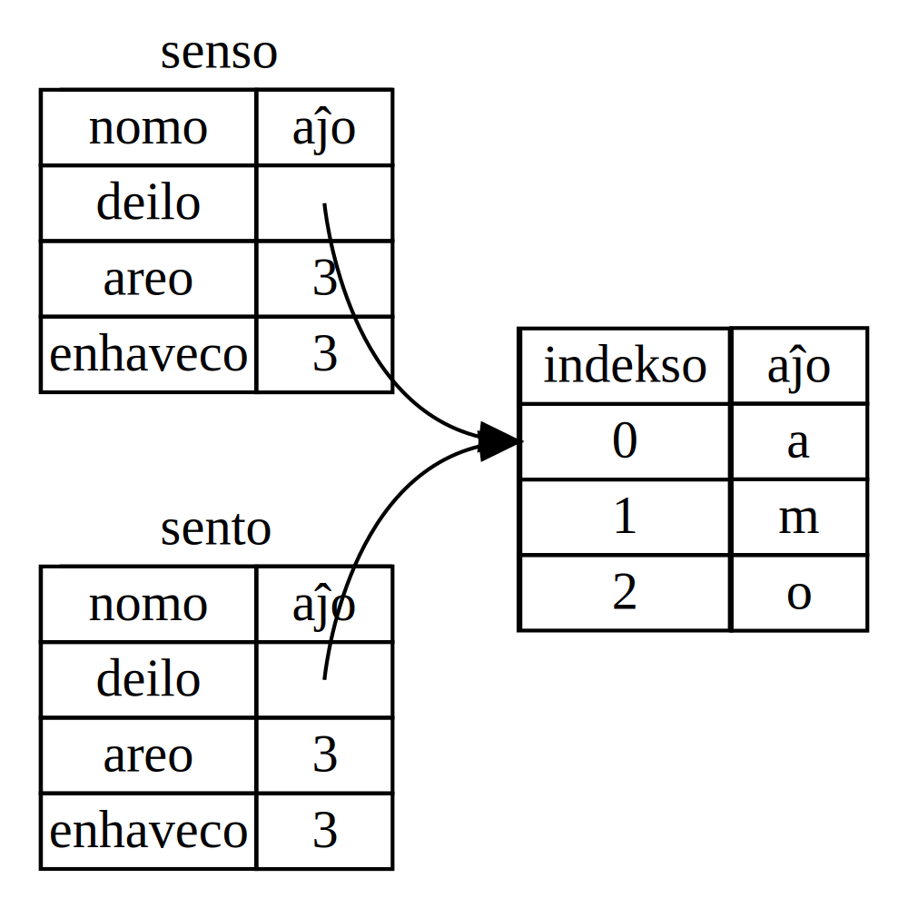

## Kio estas proprigo?

La ĉefa ivo de Rust estas *proprigo*. Kvankam la klarigo de la  ivo estas
simpla, ĝi havas profundajn implicojn por la resto de la lingvo.

Ĉiuj programoj endas estri kia uzi memoro de komputilo rultempe.
Iuj lingvoj havas senrubigo kiu senĉese zorgas pri ne plu uzanta memoro
rultempe; en aliaj lingvoj, programisto endas eksplicite okupi kaj malokupi
memoron. Rust uzas tria vojo: memoro estas estrita per sistemo de proprigo kun
regularo, kiujn la tranigilo transtempe kontrolas. Neniu el la ivo de proprigo
malrapidigas vian programon rultempe.

Ĉar proprigo estas nova koncepto por multe da programistoj, kutimiĝo daŭras.
La bona novaĵo estas ke ju pli vi spertiĝu Rust kaj la proprigo-sistemo-rularo,
des pli vi eblos spontane disvolvi sekuran kaj rendimentan kodon. Daŭrigu!

Kiam vi komprenos proprigon, vi havos firman fundamenton por kompreni la ivoj
kiuj faras Rust unikan. Ĉi ĉapitro, vi lernos proprigon per tralabori ekzemplojn
fokusantaj al ofta datena strukturo: ĉenoj.

> ### La stako kaj la staplo
>
> Multe da programalingvoj ne devigas ke disvolvistoj ofte zorgas pri stako kaj
> staplo. Sed en sistema lordonalingvo kiel Rust, la taksada konduto kaj
> kial vi farendas iajn decidojn ege dependas de ĉu la stako ĉu la staplo uzado.
> Partoj de proprigo estos priskribitaj rilate al la stako kaj la staplo en tiu
> ĉapitro, do tie estas eta antaŭa klarigo.
>
> Stako kaj staplo estas partoj de memoro kiuj estas havebla koduzante rultempe,
> sed ili estas malsame strukturitaj pri pluraj iaj. La stako stokas aĵojn
> akirorde, kaj forigas ilin inversorde. Tio estas nomita
> *lasta eniro, unua eliro*. Pensu pri stako de telero: kiam vi aldonas pli da
> telero, vi prenas unu el la supro. Aldoni kaj forigi telerojn el la mezo aŭ
> el la fundo ne funkcius tiel bone! Aldoni datenojn estas nomita
> *surstakigi* kaj forigi datenon estas nomita *elstakigi*.
>
> La stako estas rapida pro la maniero ĝi aliras datenojn: ĝi neniam bezonas
> serĉi ejon kie almeti novan datenon aŭ ejo de kie akiri datenon ĉar le ejo
> ĉiam estas la supron. Alia eco kiu faras ke la stako estas rapida estas ke
> ĉiuj datenoj supre la stako devas havi konitan, fiksitan areon.
>
> Datenoj kun transtempe nekonitaj areoj aŭ variaj areoj storiĝeblas al
> staplo anstataŭ. La staplo estas malpli rigida: kiam vi enigas datenojn sur
> la staplo, vi petas iom da spaco. La estrilo trovas sufiĉe ampleksan vakuan
> lokon ie en la staplo, markas ĝin kiel uzata, kaj liveras *deilo*, tio estas
> la adreso de la loko.
> Tiu procezo estas nomita *asignado sur staplo*, iam mallongigita kiel nur
> *asigno*. Puŝi aĵon sur la stakon ne estas konsiderata kiel asigno. Ĉar
> la deilo estas konita fisksa areo, ĝi storiĝas al la stako, kvakam sekvi la
> deilon estas necesa por akiri la efektivajn datenojn.
>
> Pensu sidiĝi ristorante. Kiam vi eniras, vi diru la nombron da ulo en via
> grupo, kaj la dungitaro trovas malplenan tabelon, kiu adaptas ĉiujn kaj
> alkondukas vin tien. Se iu en via grupo venas posttempa, ili povas demandi kie
> vi estis sidigita por trovi vin.
>
> Aliri datenojn en la staplo estas malpli rapida ol aliri datenojn sur la stako
> ĉar vi endas sekvi montrilon por iri tien. Nunaj traktiloj estas pli rapidaj
> se ili saltas malpli de unu memorero al alia. Daŭrigi la analogion, konsideru
> servulon ĉe ristoranto prenanta mendo de multe tabeloj. Ĝi estas multe pli
> efika preni ĉiujn la medojn de unu tabelo antaŭ movi al sekvantan tabelon.
> Preni mendon de unua tabelo, antaŭ mendon de dua tabelo, antaŭ denove de la
> unua kaj finfine de la dua denove estas multe pli lanta procezo. Simile,
> traktilo povas plibone fari ĝian taskon se ĝi traktas preterajn datenojn (kiel
> surstake) anstataŭ forajn datenojn (kiel surstaple). Asigni larĝan kvanto de
> spaco de la staplo ankaŭ povas preni tempon.
>
> Kiam via kodo vokas aĵigilon, la aĵoj pasitaj al la aĵigilo (inklude eble
> montriloj al datenoj de la staplo) kaj la lokaj aĵingoj puŝiĝas staken. Kiam
> la aĵigilo finas, tiuj aĵoj foreliĝas stake.
>
> Gardi spuron de kio parto de kodo uzas kion datenon de la staplo, plejetigi
> la kvanton de duoblaj datenoj en la staplo, senrubigi foruzatajn datenojn de la
> staplo do ni ne mankas spcon, estas ĉiaj problemoj ke proprigo solvas. Unufoje
> vi komprenos proprigon, vi ne plu bezonos pensi pri la stako kaj la staplo
> ofte, sed scii ke zorgi stapladatenon estas kial proprigo ekzisats povas helpi
> klarigi kial ĝi funkcias tielan.

### Reguloj de proprigo

Unue, ni rigardu la regularon de proprigo. Memoru tiujn regularojn dum ni iru
tra ekzemploj kiuj ilustras ilin:
* ĉiu donaĵo de Rust havas aĵingon kiu nomiĝas ĝia proprulo.
* eblas esti proprulo nur po unu
* kiam la proprulo fortrafebliĝas, la aĵo foreksiĝas.

### Trafejo de aĵingo

Ni jam trazorgis ekemplon de Rust-a programo dum ĉapitro 2. Nun ke ni estas post
simpla disponigo, ni ne plu inkludos ĉiujn la `fn main() {` kodon en ekzemploj,
do se vi trasekvas, vi endos meti la postajn ekzemplojn ene `main` aĵigilo ule.
Rezulte, niaj ekzemploj estos ete pli konciza, permetante al ni fokusi al
detaloj anstataŭ plenreuzema kodo.

Kiel unua ekzemplo de proprigo, ni rigardu trafejon de iuj aĵingoj. Trafejo
estas la amplekso ene de programo laŭ kiu iro validas. Diru ni havas aĵingon,
kiu ŝajnas jene:

```rust
// tie salutado iĝu cite Halo ĉiuj! bare tuj
let salutado = "Halo ĉiuj!";
```

La aĵingo `salutado` ekrilatas al ĉena memaĵo, kie la aĵo de la ĉeno
estas rektkodita en la teskto de via programo. La aĵingo validas ekde tiu
punkto de kiu ĝi estas deklarita ĝis la fino de la nuna trafejo. Listigo 4-1
havas komentoj anotaciantj kie la aĵingo `salutado` validas.


```rust
{                            // salutado ne validas ĉi tie, ĝi ne jam estas deklarita
    let salutado = "Halo ĉiuj!";   // salutado validas ekde tie ĉi posten

    // faru agojn kun salutado
}   // tiu ĉi trafejo nun estas eksa, kaj salutado ne plu validas
```

<span class="caption">Listigo 4-1: Kiomingo kaj la trafejo kie ĝi validas</span>

Alivorte, estas du grava momento tie:
* kiam `salutado` envenas trafejo, ĝi validas ;
* ĝi ade validas ĝis ĝi fortrafebliĝas.

Tiam, la rilato inter trafejoj kaj kiam aĵingoj validas, similas al tia en
aliaj programalingvoj. Nun ni konstruos sur tion komprenon per enkonduko de
la `Ĉeno` (*`String`*) tipo.

### La `Ĉeno` tipo

Por ilustri la reguloj de proprigo, ni necesas datentipo, kiu estas pli komplika
ol tiuj ni traktis en la "Datenaj tipoj" sekcio de la ĉapitro 3. Tipoj trakitaj
antaŭe ĉiuj memoriĝas stake kaj elmemoriĝas kiam ilia trafejo malvalidas, sed ni
volas zorgi pri datenoj, kiuj memoriĝas staple kaj esplore kiel Rust scias kiam
viŝi datenojn.

Ni uzos `Ĉeno` (*`String`*) kiel ekezemplo ĉi tie kaj koncentros al partoj de
`Ĉeno`, kiuj rilatas al proprigo. Tiuj aspektoj ankaŭ aplikas al aliaj
kompleksaj datenaj tipoj, provizita de norma programteko kaj ke vi povas kei.
Ni diskutos `Ĉeno` pli plene dum ĉapitro 8.

Ni jam vidis ĉenaj memaĵoj, kie ĉena aĵo estas rektkodita en nia programo.
Ĉenaj memaĵo estas oportuna, sed ne taŭgas ĉiujn situaciojn kie ni eble volus
uzi tekston. Unu kialo estas ke ili estas fiksaj. Alia kialo estas ke ne ĉiuj
ĉenaj aĵoj povas esti konita kiam ni skribas nian kodon.: ekzemple, kio okazus
se ni deziras peti enigon de uzanto kaj memori ĝin? Por tiuj situacioj, Rust
havas duan ĉenan tipon, `Ĉeno` (*`String`*). Tiu tipo estas asignita sur la
staplo transtempe kaj do povas memori kvanton da teskto ke ni ne konas transtempe.
Vi povas krei `Ĉeno` el ĉena memaĵo uzante la aĵigilo `de (*`from`*), tiel:


```rust
// tie salutado iĝu ĉeno fare eliĝi cite saluton! bare ope
let salutado = String::from("saluton!")
```

La duobla duponkto (`::`), ke ni vortigis per "fare" en la plena esperanta
komento, estas elaĵilo kiu eblas nin nomujigi tiun specifikan aĵigilon `eliĝi`
(*`from`*) de la tipo `Ĉeno` (*`String`*), anstataŭ uzi ian nomon kiel
`ĉeno_de`. Ni diskutos pri tiu disponigo plie en la "Kiomiga disponigo"
sekcio de ĉapitro 5 kaj kiam ni parolos pri nomujado kun moduloj en
"Vojoj por referi al ero ene de la modulo Ĉienaro" en ĉapitro 7.

Tiu speco de ĉeno *povas* esti variita:


```rust
// tie varia salutado iĝu ĉeno fare eliĝi cite halo bare ope tuj
let mut salutado = String::from("halo");

// salutade alĉeni "mondo!" opu (flanke ĉitado pri alĉeni)
salutado.push_str(" mondo!"); // `push_str` aldonas memaĵon al ĉeno

// linio ece el "{}", salutado opu
println!("{}", salutado); // Tio linios "saluton mondo!"
```

Do kio estas la malsamo tie? Kial `Ĉeno` povas esti variita sed memaĵoj ne
povas? La malsamo estas kiel tiuj ĉi du tipoj traktas memoron.

### Memoro kaj asignado

Kaze de ĉena memaĵo, ni scias la enhavojn transtempe, do la teksto estas
rektkodita tuje en la fina ruleblaĵo. Tio estas kial ĉenaj memaĵoj estas
rapida kaj rendimenta. Sed tiuj ecoj nur okazas danke al la fikseco de ĉenaj
memaĵoj. Malfortune, ni ne povas meti memoran datumon en la ruleblaĵo por ĉiu
peco de teksto, kies areo estas malkonita transtempe kaj kies areo povus ŝanĝi
rultempe.

Kun la tipo `Ĉeno` (*`String`*), por ivi varian, kreskeblan pecon de teksto, ni
bezonas asigni kvanto da memoro de la staplo, nekonata transtempe, por memorigi la
enhavojn. Tiu signifas:

* La memore devas esti petita al la estrilo rultempe.
* Ni bezonas vojon redoni tiun memoron al la estrilo kiam ni finis uzi nian
  ĉenon.

Tiu ĉi unua parto estas farita de ni: kiam ni vokas `ĉeno fare de`
(*`String::from`*), ĝia realigo petas memoron ke ĝi necesas. Tiu estas proksime
universa programalingvoj.

Kvankam, la dua parto estas malsama. Kun lingvoj kun senrubigilo, tiu ĉi spuras
kaj senrubigas ne plu uzitan memoron, kaj ni ne bezonas pensi pri tio. Sen
senrubigilo, estas nia respondeco identigi kiam memore ne plu uzota kaj voki
kodon por esplicite redoni ĝin, ekzate kiel ni petis ĝin. Fari tion taŭge estis
historie malfacila programa problemo. Se ni fogesas tion, ni disipas memoron.
Se ni faras ĝin tro frue, ni havos malvalida aĵingo. Se ni faras tion dufoje,
tio estas ankaŭ difekto. Ne devas pari ekazkte unu `asigni` kun ekzakte unu
`malasigni`.

Rust sekvas malsaman vojon: la memoro estas aŭtomate redonita kiam la aĵingo
kiu ricevis ĝin kiel proprigo, fortrafebliĝas. Jen estas versio de nia
ekzemplo de trafejo el Listigo 4-1 uzante `Ĉeno` (*`String`*) anstataŭ ĉena
memaĵo.


```rust
// jene
{
    // tie salutado iĝu ĉeno fare de "saluton" ope tuj
    let salutado = "saluton";   // salutado validas ekde tie ĉi posten

    // faru agojn kun salutado
// are
}   // tiu ĉi trafejo nun estas eksa, kaj salutado ne plu validas
```
Estas evidenta ejo kie post kiu redoni memoron ke nia ĉeno necesas al la
estrilo: kiam `salutado` fortrafebliĝas. Kiam aĵingo fortrafebliĝas,
Rust vokas specian aĵigilon por ni. Tiu aĵigilo estas nomita `forigi` (*`drop`*)
kaj estas kie la verkisto de `Ĉeno` (*`String`*) povas placi kodon por redoni
memoron. Rust vokas `forigi` (*`drop`*) aŭtomate al kodblokfino, tio estas al
arigejo signita de fermanta kuniga krampo.

> Notu: En C++, tiu skemo de rimeda malasignado ĉe fino de trafebleco de ero
> estas iam nomita *rimeda akiro ekuzu*
> (*Resource Acquisition Is Initialization*, mallongige *RAII*).
> La aĵigilo `forigi` (*`drop`*) de Rust estos familiara por vi se vi jam uzis
> tiun skemon.

Tiu skemo havas profundan efikon pri kiel Rusta kodo estas verkita. Tio eble
ŝajnas simpla nun, sed la konduto de la kodo povas deveni malatendota en pli
komplikaj situacioj, kiam ni volas havi plurajn aĵingojn kiuz uzas la datenon
ke ni asignis al la staplo. Ni esploru kelkajn tiajn situaciojn nun.


#### Interagaj manieroj de aĵingoj kaj datenoj: movi

Pluraj aĵingoj povas inteagi kun la samaj datenojn laŭ malsamaj manieroj per
Rust. Ni rigardu ekzemplon uzanta entjero en Listigo 4-2.

```rust
// tie ero iĝu 5 tuj
let ero = 5;
// tie amo iĝu ero tuj
let amo = ero;
```

<span class="caption">Listing 4-2: Alsignad de entjera aĵo el aĵingo `ero`
al aĵingo `amo`</span>

Ni ja povas divini kion faras tio: "ligu la aĵo `5` al `ero`; tiam kopiu la
aĵon ene de `ero` kaj ligu ĝin al `amo`". Ni nun havas du aĵojn, `ero` kaj
`aro`, kaj ambaŭ kiomas `5`. Tiu estas ja kio okazas, ĉar entjeroj estas simplaj
aĵoj kun konita fiksa areo kaj tiuj ĉi du `5` aĵoj estas almetita sur la
stakon.

Nun, ni rigardu al la ĉena version

```rust
// tie senso iĝu ĉeno fare de "amo" opu
let senso = String::from("amo");
// tie sento iĝu senso tuj
let sento iĝu senso;
```

Tiu ŝajnas tre simila kun la antaŭa kodo, do ni povus supozi ke la maniero tiu
funkcias estus la sama: tio estas, la dua linio kopius la aĵo de `senso` kaj
ligus ĝin al `sento`. Sed tiu ne estas ekzate kio okazas.

Rigardu la figuro 4-1 por vidi kio okazas al `Ĉeno` (*`String`*) sub la kovro.
`Ĉeno` (*`String`*) estas farita de tri partoj, montritaj live: deilo al memoro
kiu entenas enhavojn de la ĉeno, areon kaj enhaveco. Tiu grupo de datenoj estas
memoritaj super la stako. Dekstre estas memoro sur la staplo kiu entenas la
enhavon.


<span class="caption">Figure 4-1: Prezento en memoro de `Ĉeno` (*`String`*)
tenanta la aĵo `"halo"``ligita al `senso`</span>

La areo estas kiom da iomopa memoro la enhavoj de `Ĉeno` (*`String`*) estas nune
uzanta. La enhaveco estas la tuto da iomopa memoro ke la estrilo provizis al la
ĉeno. La malsamo inter areo kaj enhaveco gravas, sed ne en ĉi tiu konteksto, do
tie ĉi, tio estas negrava ignori la enhavecon.

Kiam ni alsignas `senso` al `sento`, la dateno de la `Ĉeno` estas kopiita, tio
estas, ni kopias la deilo, la areo kaj la enhaveco kiuj ne estas sur la stako.
Ni ne kopias datenojn de la staplo al kiu la deilo referas. Alivorte, la datena
prezento enmemore sâjnas kiel Figuro 4.2.




<span class="caption">Figure 4-2: Prezento en memoro de aĵingo `sento` kiu
havas kopion de la deilo, de la areo kaj de la enhaveco de `senso`</span>

La prezento *ne* ŝajnas kiel la Figuro 4-3, kiu estas memoro ŝajnus se Rust
anstataŭ kopius ankaŭ staplajn datenojn. Se Rust faris tion, la operacio
`sento = senso` povus esti kostega laŭ rultempa rendimento se datenoj sur staplo
estas pezegaj.


<span class="caption">Figure 4-3: Alia ebla interpreto de `sento = senso` se
Rust ankaŭ kopius datenojn el staplo.</span>

Pli frue, ni diris ke kiam aĵingo eliras trafejon, Rust aŭtomate vokas la
`forigi` (*`drop`*) aĵigilo kaj senrubigas la staplan memoron de tiu aĵingo. Sed
Figuro 4-2 montras ambaŭ datena deiloj almontrantaj la sama loko. Tiu estas
problemo: kiam `sento` kaj `senso` fortrafebliĝas, ili ambaŭ pravos liberigi la
saman memoron. Tiu estas konita kiel la eraro de *duobla liberigo* kaj estas unu
el difektoj de memora sekurigo. Liberigi memoron dufoje povas konduki al korupto
de memoro, kiu potence povas konduki al sekura vundeblo.

Por certigi memoran sekurecon, estas unu plia detajlo pri kio okazas en tiu
situacio kun Rust. Anstataŭ pravi kopii la asignatan memoron, Rust konsideras
`senso` kiel ne plu valida kaj do Rust ne bezonas liberigi ion ajn kiam
`senso` fortrafebliĝas. Kontrolu kio okazas kiam vi pravas uzi `senso` post
`sento` estas kreita; tio ne aĵigilos.

```rust,ignore,does_not_compile
// tie senso iĝu ĉeno fare de "halo" opu
let senso = String::from("amo");
// tie sento iĝu senso
let sento = senso;

// linio ece el "{}" je senso opu
println!("{} disvolvado!", senso);
```

Vi ricevos eraron kiel poste ĉar Rust neebligas vin uzi malvalidata referenco:

```text
------------------------------Tradukita mesaĝo----------------------------------
eraro[E0382]: uzo de movita aĵo: `senso`
 --> fontaro/ĉefo.rs:5:28
  |
3 |     let sento = senso;
  |         -- value moved here
4 |
5 |     println!("{}, disvolvado!", senso);
  |                                 ^^ aĵo uzita tie post movo
  |
  = notu: movo okazas ĉar `senso` havas tipon `std::string::String`, kiu ne
  realigas la `Kopii` trajto

------------------------------Origina mesaĝo------------------------------------

error[E0382]: use of moved value: `senso`
 --> src/main.rs:5:28
  |
3 |     let sento = senso;
  |         -- value moved here
4 |
5 |     println!("{}, disvolvado!", senso);
  |                                 ^^ value used here after move
  |
  = note: move occurs because `senso` has type `std::string::String`, which does
  not implement the `Copy` trait
```

Se vi aŭdis la termo *skema kopio* kaj *plena kopio* uzante aliaj lingvoj, la
koncepto de kopii la deilon, la areon kaj la enhaveco sen kopii la datenojn
verŝajne aspektos simile al skema kopio. Sed pro Rust ankaŭ malvalidas la unua
aĵingo, anstataŭ nomi tion "skema kopio", tio estas konita kiel "movo". En tiu
ekzemplo, ni dirus ke `senso` estis *movita* al `sento`. Do kio fakte okazas
estas montrita en Figuro 4-4.


<span class="caption">Figure 4-4: Prezento de memoro post `senso` estis
malvalidita</span>

Tio solvas nian problemon! Kun nur `sento` ankoraŭ valida, kiam ĝi
fortrafebliĝos, ĝi sole liberigos memoro, kaj ni plenigu!

Aldone, estas kadra elekto implicita per tio: Rust neniam aŭtomate krei plenan
kopion de viaj datenoj. Tial, ajna *aŭtomata* kopio povas esti supozita malkosta
rultempa-redimente.

#### Manieroj per kiuj aĵingoj kaj datenoj interagas: kloni

Se ni *ja* deziras plene kopii la staplajn datenojn de `Ĉeno` (*`String`*), ne
nur la stakaj datenoj, ni povas uzi la universala aĵigilo nomita `kloni`
(*`clone`*). Ni diskutos disponigon de aĵigiloj dum ĉapitro 5, sed ĉar aĵigiloj
estas universala ivo de multe da programalingvoj, vi probable jam vidis ilin
antaŭe.

Jen estas ekzempo de `kloni` (*`clone`*) aĵigilo en ago:

```rust
// tie senso iĝu ĉeno fare de "amo" opu
let senso = String::from("halo");
// tie sento iĝu senso klonata
let sento = senso.clone();

// linio ece el "senso estas {}, sento estas {}" je senso je sento opu
println!("senso = {}, sento = {}", senso, sento);
```

Tiu bone funkcias kaj esplicite produktas la konduton montritan en Figuro 4-3,
kie la stapla datenaro *ja* estas kopiita.

Kiam vi vidas vokon al `kloni` (*`clone`*), vi scias ke kelkan arbitran kodon
estas rulita kaj ke kodo povas esti kosta. Estas videca indikeco ke io malsama
okazas.

#### Nurstaka dateno: kopii

Estas unu plia afero pri kiu ni ne ankorŭ diskutis. Tiu posta kodo uzanta
entjeroj, parto de tio kio estis montrita en Listigo 4-2, funkcias kaj estas
valida:

```rust
// tie ero iĝu 5 tuj
let ero = 5;
// tie amo iĝu ero tuj
let amo = ero;

println!("ero = {}, amo = {}", ero, amo);
```

Sed tiu kodo ŝajnas malkongrua kun tio ke ni ĵus lernis: ni ne faris vokon al
`kloni` (*`clone`*), sed `ero` ankoraŭ estas valida kaj ne estis movita al
`amo`.

La kialo estas ke tipoj kiel entjeroj, kiuj havas konitan areon transtempe estas
memorita tute surstake, do kopioj de faktaj aĵoj estas rapide faritaj. Tio
signifas ke estas neniu kialo ni dezirus malebligi `ero` pri esti valida post ni
kreas aĵingo `amo`. Alivorte, estas nenia malsamo inter plena kaj sekma kopio
tio, do voki `kloni` ne farus ian ajn malasaman ol kutima skema kopio kaj ni
povas forlasi tion.

Rust havas specialan noton nomitan `Kopio` (*`Copy`*) trajto ke ni povas loki al
tipoj kiel entjeroj kiuj estas memoritaj stake (ni parolos plie pri trajtoj dum
ĉapitro 10). Se tipo havas la trajton `Kopio`, pli olda aĵingo estas ankoraŭ
uzebla post alsignado. Rust ne lasos nin noti tipon kun la `Kopio` trajto se la
tipo, aŭ ajna de ĝia partoj, ivigis la `Fino` (*`Drop`*) trajto. Se la tipo
bezonas ke iun specialan okazas kiam la aĵo fortrafiĝas kaj ni aldonas la
`Kopio` noto al tiu tipo, ni havostranstempan eraron. Por lerni pri kiel aldoni
la `Kopio` noto al via tipo, vidu "Deriveblaj trajtoj" ĉe apendico C.

Do, kiuj tipoj estas `Kopio`? Vi povas kontroli la dokumentaro por la zorgota
tipo por certigi, sed kiel ĝenerala regulo, ajna grupo de simpla skalara aĵo
povas estas `Kopio`, kaj neniu kiu necesas asignon aŭ estas ia speco de rimedo
estas `Kopio`. Tie estas kelkaj tipoj kiuj estas `Kopio`:

* ĉiuj entjeraj tipoj, kiel `u32`;
* la duiomiva tipo, `bool`, kun aĵo `vera` (*`true`*) kaj `falsa` (*`false`*);
* ĉiuj ŝovonaj tipoj, kiel `f64`;
* la signa tipo, `signo` (*`char`*);
* opo, se ili nur enhvas tipojn kiuj ankaŭ estas `Copy`. Ekzemple `(i32, i32)`
  estas `Kopio`, sed `(i32, String)` ne estas tia.

### Proprigo kaj aĵigiloj

Semantikoj por pasi aĵojn al aĵigilo estas simila ol tiuj por alsigni aĵon
al aĵingo. Pasi aĵingo al aĵigilo movos aŭ kopios, ĵus kiel alsigno faras.
Listigo 4-3 havas ekzemplon de iuj notoj montrantaj kie aĵingoj ek- kaj
for-trafebliĝas.

<span class="filename">Datenujnomo: src/main.rs</span>

```rust
// ĉi ĉefu ige
fn main() {
    // tie salutado iĝu ĉeno fare de "halo" opu
    let salutado = String::from("halo");  // salutado ektrafebliĝu

    // proprigi salutado opu
    takes_ownership(salutado);      // aĵo de salutado movas enen funkction
                                    // ... kaj do eksvalidiĝas tie

    // tie ero iĝu 5 tuj
    let ero = 5;                    // ero comes into scope

    // kopiigi eron opu
    makes_copy(ero);                // ero movus funkcien, sed i32 estas Kopio,
                                    // do estas taŭga ankoraŭ uzi eron poste

} // Tie, ero fortrafebliĝas, ĵus antaŭ salutado faras same. Sed ĉar aĵo de
  // salutado movis, neniu speciala okazas.

// ĉi proprigi iuĉenon kiel ĉeno ige
fn proprigi(iuĉeno: String) { // iuĉeno ektrafebliĝas
    // linio ece el "{}" je iuĉeno opu
    println!("{}", iuĉeno);
} // Tie ĉi, iuĉeno fortrafebliĝas kaj `forigi` (*`drop`*) estas vokita.
  // La apogila memoro estas liberigita.

// ĉi kopiigi iuentjero kiel i32 ige
fn kopiigi(iuentjero: i32) { // some_integer comes into scope
    // linio ece el "{}" je iuentjero opu
    println!("{}", iuentjero);

} // Tie ĉi, iuentjero fortrafebliĝas. Neniu speciala okazas.
```

<span class="caption">Listigo 4-3: Funkcioj kun notitaj proprigo kaj trafejo
</span>

Se ni pravis uzi `salutado` post la voko al `proprigi` (*`takes_ownership`*),
Rust ĵetustranstempan eraron. Tiuj statikaj kontroloj protektas nin de eraroj.
Pravu aldoni kodo al `ĉefi` (*`main`*) kiu uzas `salutado` kaj `ero` por vidi
kie vi povas uzi ilin kaj kie la reguloj de proprigo malebligas vin fari tion.

### Adresaj aĵoj kaj trafejo

Adresaj aĵoj povas ankău transdoni proprigon. Listigo 4-4 estas ekzempol kun
similaj notoj ol tiuj de Listigo 4-3.

<span class="filename">Datenujnomo: src/main.rs</span>

```rust
// ĉi ĉefi ige
fn main() {
    // tie senso iĝe proprigodonas
    let senso = proprigodoni();         // proprigodoni movas ĝia adresa aĵo
                                        // al senso

    // tie sento iĝu ĉeno fare de "amo" opu
    let sento = String::from("amo");    // sento ektrafebliĝas

    // tie senco iĝu prenikajredoni senton opu
    let senco = prenikajredoni(sento);  // sento estas movita al prenikajredoni,
                                        // kiu ankaŭ movas ĝian adresan aĵon
                                        // al senco
                                        // moves its return value into senco
} // Tie ĉi, `senco` fortrafebliĝas kaj estas forigita.
  // Ankaŭ `sento` fortrafebliĝas, sed estis movita, do neniu okazas.
  // Finfine `senso` fortrafebliĝas kaj estas forigita.

// ĉi proprigodonu kiele ĉeno ige
fn proprigodoni() -> String {                // proprigodoni movos ĝian adresan
                                             // aĵon en ĝia vokanta aĵigilo

    // tie iuĉeno iĝu ĉeno fare de "halo" opu
    let iucxeno = String::from("halo");      // iuĉeno ektrafebliĝas

    iucxeno                                  // iucxeno estas adresata kaj
                                             // elmovas al la vokanta aĵigilo
}

// `prenikajredoni` postulos kaj adresos ĉenon
// ĉi prenikajredoni iaĉenon kiel ĉeno ope kiele ĉeno jene
fn prenikajredoni(iacxeno: String) -> String { // iacxeno ektrafebliĝu

    iacxeno  // iacxeno estas adresata kaj elmovas al la vokanta aĵigilo
}
```

<span class="caption">Listigo 4-4: Trandoni proprigon de adresa âjo</span>

La proprigo de aĵingo ĉiam sekvas la saman skemon: alsigni aĵon al alia aĵingo
movas ĝin. Kiam âjingo kiu stake inkludas datenon fortrafebliĝas, la aĵo estas
senrubigita per `forigi` (*`drop`*), krom se datenojn estis movitaj por esti
proprigo de alia aĵingo.

Preni proprigon kaj poste adresi ĝin kun ĉiu aĵigilo estas iomete teda. Kio
okazus se ni dezirus ke iu aĵigilo uzas aĵon sed ne prenas proprigilon? Tio
agecetas ke ion ajn ni pasigas ankaŭ necesas esti retropasigita se ni volas uzi
ĝin denove, aldone al adresotaj datenoj el la trakto de la aĵigilo ke ni ankaŭ
volus adresi.

Estas ebla adresi plurajn aĵon uzante opo, kiel montrata en listigo 4-5.

<span class="filename">Datenujnomo: src/main.rs</span>

```rust
// ĉi ĉefi ige
fn main() {
    // tie senso iĝu ĉeno fare de "amo" opu
    let senso = String::from("amo");

    // tiu sento, longo ope iĝu longokalkuli senson opu
    let (sento, longo) = longokalkuli(senso);

    // linio ece el "{}" je iuentjero opu
    println!("La longo de '{}' estas {}.", sento, longo);
}

// ĉi longokalkuli salutado kiel ĉeno ope
// kiele el ĉeno, sensignuma-entjero-areo ige
fn longokalkuli(sperto: String) -> (String, usize) {
    // tie longo iĝu
    let longo = sperto.len(); // `len()` adresas longon de ĉeno

    (sperto, longo)
}
```

<span class="caption">Listigo 4-5: Adresanta proprigo de kunaĵingoj</span>

Sed tiu estas tro da solenaĵo kaj multe da laboro por unu koncepto kiu devus
esti simpla. Ŝance por ni, Rust havas ivojn por tiu koncepto, nomita
*referencoj*.
